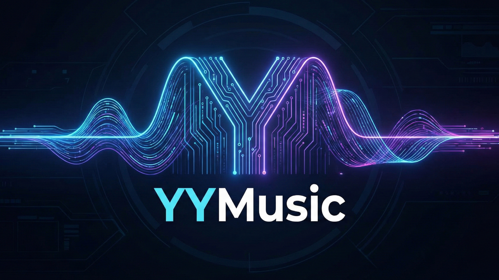

# YYMusic - 基于 AIGC 驱动的音乐生成及商业化 Web 平台 (后端)

| **项目名称** |            YYMusic Backend             |
| :----------: | :------------------------------------: |
| **项目类型** |       **毕业设计 / 企业级项目**        |
| **核心概念** | **AIGC、音乐生成、电子商务、支付集成** |

## 📖 项目简介

本项目是 **基于 AIGC 驱动的音乐生成及商业化 Web 平台** 的后端源码。项目旨在利用人工智能技术（AIGC）为用户提供自动化的音乐创作服务，并构建完整的商业化闭环，包含用户积分体系及多渠道支付功能。

系统采用标准的 **Spring Boot** 多模块架构开发，区分了前台用户端 (`yymusic-web`) 和后台管理端 (`yymusic-admin`)，实现了清晰的权限分离和业务解耦。

## 🛠 技术栈

### 核心框架

- **开发语言**: Java (JDK 21)
- **后端框架**: Spring Boot (3.5.x)
- **ORM 框架**: MyBatis / MyBatis-Plus (XML 映射配置)
- **数据库**: MySQL(8.0)
- **缓存/中间件**: Redis
- **构建工具**: Maven

## 📂 项目结构

本项目采用 Maven 多模块构建：

```
yymusic-backend
├── yymusic-admin       # 后台管理端模块
│   ├── src/main/java/com/yymusic/controller   # 管理员接口 (用户管理、订单管理、系统字典等)
│   └── ...
├── yymusic-web         # 前台用户端模块
│   ├── src/main/java/com/yymusic/controller   # 用户接口 (创作音乐、购买、个人中心等)
│   └── ...
├── yymusic-common      # 公共模块 (核心)
│   ├── src/main/java/com/yymusic
│   │   ├── api          # 第三方API封装 (AIGC接口、支付接口)
│   │   ├── entity       # 数据库实体 (PO) 及 DTO/VO
│   │   ├── mappers      # MyBatis Mapper 接口
│   │   ├── service      # 业务逻辑接口
│   │   ├── utils        # 工具类 (Redis, Date, File, OKHttp)
│   │   └── ...
│   └── src/main/resources/com/yymusic/mappers # MyBatis XML 文件
└── pom.xml             # 父工程依赖管理
```

## 🌟 核心功能模块

### 1. AIGC 音乐创作与回调编排

- 支持歌曲/纯音乐两类创作模式，并区分普通/高级创作参数。
- 创作时可携带提示词、歌词、曲风、情绪、音色、和弦、调式等音乐设置。
- 已接入 [Tianpuyue](https://platform.tianpuyue.cn/docs) 与 ComfyUI 两类生成能力，并通过回调接口更新生成状态。
- 创作任务会写入创作记录与音乐记录，前端可轮询查询创建中的音乐是否完成。
- 提供音乐详情、创作详情、推荐音乐、最新音乐、播放次数更新、点赞等能力。

### 2. 用户账号、个人中心与积分体系

- 支持验证码、用户注册、登录、登出、登录态获取与密码修改。
- 登录态与验证码均基于 Redis 缓存管理，接口带有统一登录拦截。
- 用户可修改昵称与头像，查看个人积分记录、个人作品、点赞作品与公开主页。
- 音乐生成会扣减积分，充值成功后自动增加积分，并记录积分流水。

### 3. 商业化支付与订单闭环

- 支持在售积分商品加载与后台商品配置。
- 已实现支付宝、微信支付与支付码三种充值方式。
- 包含下单、支付信息获取、异步支付回调、支付结果轮询、数据库兜底查询等完整流程。
- 订单具备未支付、已支付、超时等状态流转，并带有 Redis 延迟队列超时处理逻辑。
- 支付成功后自动为用户发放积分，并缓存支付完成标记供前端快速确认。

### 4. AI 辅助能力

- 提供基于外部 Bit Agent 的文本润色/歌词生成流式接口。
- 提供基于 Spring AI 的智能客服接口，支持普通问答和流式问答。
- 智能客服结合向量检索（RAG）与自定义工具，可查询套餐、音乐、用户作品等业务信息。

### 5. 文件与资源管理

- 支持头像、商品封面、音乐封面等文件上传与资源访问。
- 文件访问接口支持 Range 请求，适合图片与音频资源读取。
- 文件存储可按配置切换为本地存储、MinIO 或 FTP 远程存储。

### 6. 后台管理能力

- 后台管理员支持验证码登录与 Token 退出。
- 支持用户列表查询、启用/禁用用户、后台增减积分。
- 支持音乐列表管理与推荐位调整。
- 支持订单列表查看、商品新增/编辑/删除/排序。
- 支持支付码生成、删除、按商品生成支付码。
- 支持系统字典维护，作为音乐模型与前端配置项的数据来源。

## ✅ 项目功能总结

从当前代码实现看，`YYMusic` 后端已经不仅是一个“调用 AIGC 生成音乐”的接口服务，而是一个完整的音乐创作商业平台后端，覆盖了：

- **创作侧**：音乐生成、创作参数配置、生成状态回调、作品管理。
- **用户侧**：账号体系、个人中心、头像资料维护、积分流水。
- **商业侧**：商品、订单、支付渠道、支付回调、积分充值闭环。
- **AI 侧**：歌词/文本润色智能体、RAG 智能客服、业务工具接入。
- **运维侧**：Swagger 文档、Redis 缓存、可切换 OSS 存储、后台管理端。

整体上，该项目已经具备“AI 音乐生成 + 用户运营 + 商业化支付 + 后台运营管理”的完整后端能力。

## 🚀 快速开始

### 1. 环境准备

确保您的开发环境已安装：

- JDK 21 或更高版本
- Maven 3.6+
- MySQL 8.0
- Redis

### 2. 数据库&配置文件配置

1. 创建数据库 `yymusic` 。
2. 导入提供的 `yymusic.sql` 脚本以初始化表结构。
3. 修改配置文件：
   - 打开 `yymusic-admin/src/main/resources/application.yml`
   - 打开 `yymusic-web/src/main/resources/application.yml`
   - **修改数据库连接** (`url`, `username`, `password`)。
   - **修改 Redis 连接** (`host`, `port`, `password`)。
   - **配置 AIGC API Key** (如有相关配置项)。

### 3. 编译与运行

在项目根目录下执行 Maven 编译：

```
mvn clean install
```

**启动后台管理端:** 运行 `yymusic-admin/src/main/java/com/yymusic/YYMusicAdminApplication.java`

**启动前台用户端:** 运行 `yymusic-web/src/main/java/com/yymusic/YYMusicWebApplication.java`

### 4. 访问接口文档

启动成功后，通常可以通过以下地址访问 Swagger 文档

- http://localhost:8090/swagger-ui.html (web端)
- http://localhost:8091/swagger-ui.html (admin端)

## 📄 版权说明

本项目为毕业设计/个人开发项目，代码仅供学习与交流使用。
